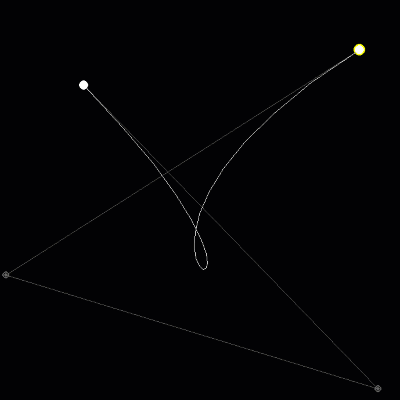
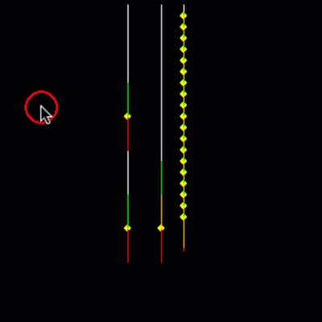

# Pygame Graphic Playground

This project is about testing graphic drawing computation using pygame 
There's no extra library to handle drawing, it use pygame native drawing function 
It only handle the basic game loop

## Requirement
- Python 3.5 and up
- Pygame 2.1

## Example
Here's some graphic that I created  

**Bézier Curve Tween** 

**Vine SImulation** 
